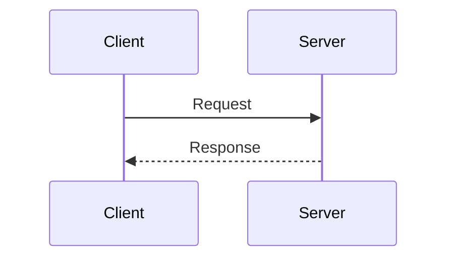

# SoundHash Documentation

This directory contains the source files for SoundHash's documentation site, built with [MkDocs Material](https://squidfunk.github.io/mkdocs-material/).

## Quick Start

### Prerequisites

- Python 3.11+
- pip

### Installation

```bash
# Install documentation dependencies
pip install -r requirements-docs.txt
```

### Local Development

```bash
# Serve documentation locally with live reload
mkdocs serve

# Documentation will be available at http://localhost:8000
```

### Building

```bash
# Build static site
mkdocs build

# Output will be in ./site directory
```

## Documentation Structure

```
docs/
├── index.md                    # Landing page
├── getting-started/            # Installation and quick start
│   ├── index.md
│   ├── installation.md
│   ├── quick-start.md
│   ├── configuration.md
│   └── first-match.md
├── guides/                     # Step-by-step tutorials
├── api/                        # API reference documentation
├── deployment/                 # Production deployment guides
├── architecture/               # System design and internals
├── development/                # Contributing and development
├── reference/                  # Quick reference and troubleshooting
├── scripts/                    # Documentation build scripts
├── stylesheets/                # Custom CSS
└── javascripts/                # Custom JavaScript
```

## Writing Documentation

### Markdown Extensions

We use several Markdown extensions for enhanced documentation:

#### Admonitions

```markdown
!!! note
    This is a note admonition

!!! warning
    This is a warning

!!! tip
    This is a helpful tip
```

#### Code Blocks with Tabs

```markdown
=== "Python"
    ```python
    print("Hello World")
    ```

=== "JavaScript"
    ```javascript
    console.log("Hello World");
    ```
```

#### Mermaid Diagrams

```markdown
\```mermaid
graph LR
    A[Start] --> B[Process]
    B --> C[End]
\```
```

#### Cards Grid

```markdown
<div class="grid cards" markdown>

-   :material-icon:{ .lg } **Title**
    
    ---
    
    Description text
    
    [Link →](url)

</div>
```

### Style Guide

- **Headings**: Use sentence case (capitalize first word only)
- **Code**: Use inline code for `commands`, `variables`, and `file names`
- **Links**: Use descriptive link text, not "click here"
- **Examples**: Include working code examples that can be copy-pasted
- **Screenshots**: Save as PNG in `docs/images/` directory
- **Diagrams**: Prefer Mermaid diagrams over images when possible

## Adding New Pages

1. Create a new Markdown file in the appropriate directory
2. Add the page to `mkdocs.yml` navigation
3. Test locally with `mkdocs serve`
4. Commit and push changes

Example:

```yaml
# mkdocs.yml
nav:
  - Home: index.md
  - Getting Started:
      - getting-started/index.md
      - New Page: getting-started/new-page.md  # Add here
```

## Mermaid Diagrams

We use Mermaid for creating diagrams. Supported diagram types:

- **Flowcharts**: `graph TD` or `graph LR`
- **Sequence diagrams**: `sequenceDiagram`
- **Class diagrams**: `classDiagram`
- **State diagrams**: `stateDiagram-v2`
- **Entity relationship**: `erDiagram`

Example:



## API Documentation

API documentation is auto-generated from the OpenAPI specification:

- Source: `src/api/main.py` (FastAPI app)
- Generator: `docs/scripts/gen_api_docs.py`
- Output: `docs/api/reference.md`

To regenerate:

```bash
python docs/scripts/gen_api_docs.py
```

## Deployment

### GitHub Pages

Documentation is automatically deployed to GitHub Pages when changes are pushed to the `main` branch.

The deployment workflow is defined in `.github/workflows/deploy-docs.yml`.

### Manual Deployment

```bash
# Deploy to GitHub Pages
mkdocs gh-deploy

# Deploy with versioning (using mike)
mike deploy --push --update-aliases 1.0 latest
mike set-default --push latest
```

### Custom Domain

To configure a custom domain (e.g., docs.soundhash.io):

1. Add a `CNAME` file to `docs/`:
   ```
   docs.soundhash.io
   ```

2. Configure DNS:
   - Add CNAME record: `docs` → `your-org.github.io`
   - Or A records for GitHub Pages IPs

3. Enable HTTPS in repository settings

## Versioning

We use [mike](https://github.com/jimporter/mike) for documentation versioning:

```bash
# Deploy new version
mike deploy 1.0

# Set as latest
mike alias 1.0 latest

# Set as default
mike set-default latest

# List versions
mike list

# Delete version
mike delete 1.0
```

## Contributing

### Before Committing

1. **Build and test locally**:
   ```bash
   mkdocs serve
   # Open http://localhost:8000 and verify changes
   ```

2. **Check for broken links**:
   ```bash
   mkdocs build
   # Review any warnings
   ```

3. **Follow the style guide** (see above)

4. **Update navigation** in `mkdocs.yml` if adding new pages

### Pull Request Process

1. Create a feature branch
2. Make your documentation changes
3. Test locally
4. Commit with descriptive message
5. Push and create PR
6. Documentation build status will be checked automatically

## Maintenance

### Updating Dependencies

```bash
# Update all documentation dependencies
pip install --upgrade -r requirements-docs.txt

# Update specific package
pip install --upgrade mkdocs-material

# Freeze updated versions
pip freeze | grep -E '(mkdocs|markdown|pymdown)' > requirements-docs.txt
```

### Checking for Broken Links

```bash
# Build in strict mode (fails on warnings)
mkdocs build --strict
```

### Performance

MkDocs is optimized for fast builds and serving. If builds become slow:

1. **Reduce plugin usage**: Disable unnecessary plugins in `mkdocs.yml`
2. **Optimize images**: Compress images before adding to docs
3. **Lazy load**: Use lazy loading for images and heavy content
4. **Cache**: Enable caching for API docs generation

## Troubleshooting

### "Page not found in nav"

**Problem**: Warning about pages not in navigation

**Solution**: Either add to `mkdocs.yml` nav or move to a different location

### "Mermaid diagram not rendering"

**Problem**: Mermaid diagram shows as code block

**Solution**: 
- Check the code block uses ` ```mermaid ` (3 backticks)
- Verify mermaid2 plugin is enabled in `mkdocs.yml`
- Check diagram syntax with [Mermaid Live Editor](https://mermaid.live)

### "Build fails with import error"

**Problem**: Python import errors during build

**Solution**:
```bash
# Reinstall dependencies
pip install -r requirements-docs.txt --force-reinstall
```

### "Search not working"

**Problem**: Search returns no results

**Solution**:
- Rebuild the site: `mkdocs build --clean`
- Check search plugin is enabled in `mkdocs.yml`

## Resources

- [MkDocs Documentation](https://www.mkdocs.org/)
- [Material for MkDocs](https://squidfunk.github.io/mkdocs-material/)
- [Mermaid Documentation](https://mermaid.js.org/)
- [Python-Markdown Extensions](https://python-markdown.github.io/extensions/)
- [PyMdown Extensions](https://facelessuser.github.io/pymdown-extensions/)

## Support

For questions or issues with the documentation:

1. Check this README
2. Review [MkDocs Material documentation](https://squidfunk.github.io/mkdocs-material/)
3. Open an issue in the repository
4. Ask in GitHub Discussions

## License

Documentation is licensed under [CC BY 4.0](https://creativecommons.org/licenses/by/4.0/).

Code examples in the documentation are licensed under the project's main license.
