# System Overview

This page provides a high-level overview of SoundHash's architecture, components, and data flow.

## System Architecture

The following diagram shows the main components and their interactions:

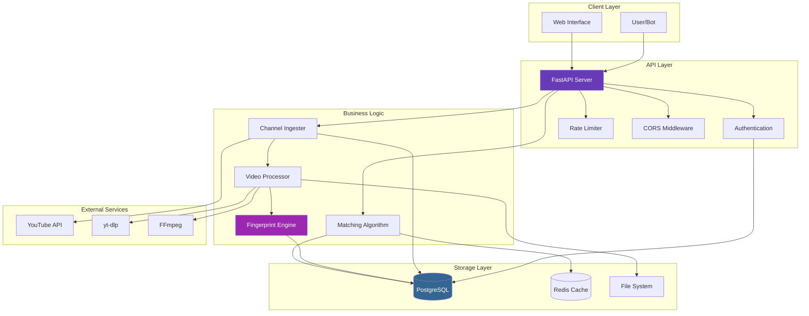

### Component Layers

#### 1. Client Layer

- **Users**: Direct API consumers
- **Bots**: Social media integration (Twitter, Reddit)
- **Web Interface**: Interactive documentation (Swagger/ReDoc)

#### 2. API Layer

- **FastAPI Server**: REST endpoints and WebSocket
- **Authentication**: JWT-based auth and API keys
- **Rate Limiter**: Request throttling per user/IP
- **CORS**: Cross-origin resource sharing

#### 3. Business Logic

- **Channel Ingester**: YouTube channel video fetching
- **Video Processor**: Audio download and conversion
- **Fingerprint Engine**: Spectral analysis and feature extraction
- **Matching Algorithm**: Similarity computation

#### 4. Storage Layer

- **PostgreSQL**: Fingerprints, videos, users, matches
- **Redis**: Query result caching (optional)
- **File System**: Temporary audio files

#### 5. External Services

- **YouTube API**: Channel and video metadata
- **yt-dlp**: Video/audio download
- **FFmpeg**: Audio format conversion

---

## Data Flow

### Ingestion Pipeline

The following sequence shows how videos are ingested and processed:

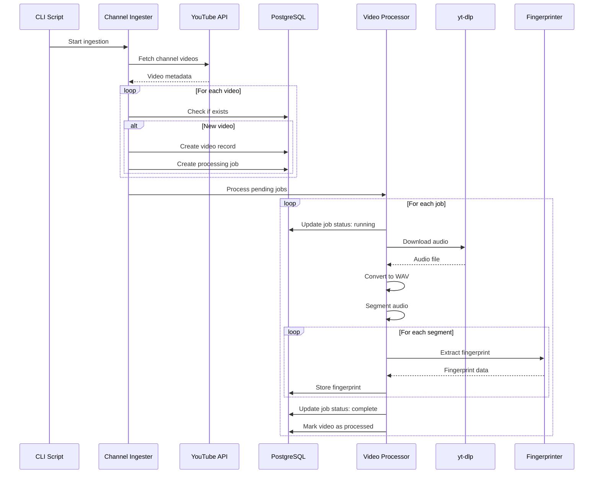

### Matching Pipeline

The following sequence shows how a query clip is matched:

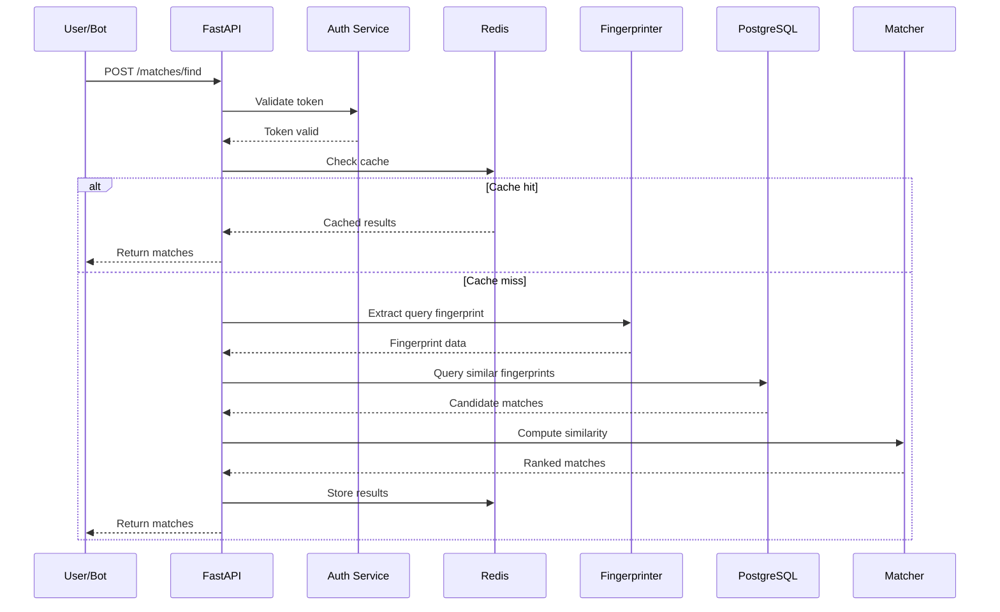

---

## Processing Pipeline Details

### Stage 1: Video Download

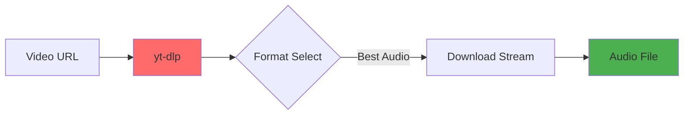

**Purpose**: Extract audio from video  
**Tools**: yt-dlp with cookie/proxy support  
**Output**: Audio file (various formats)

### Stage 2: Audio Conversion

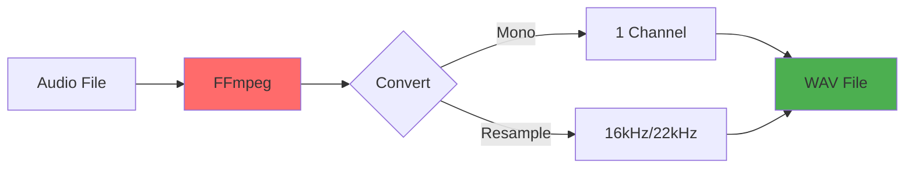

**Purpose**: Standardize audio format  
**Tools**: FFmpeg  
**Output**: Mono WAV at configured sample rate

### Stage 3: Segmentation

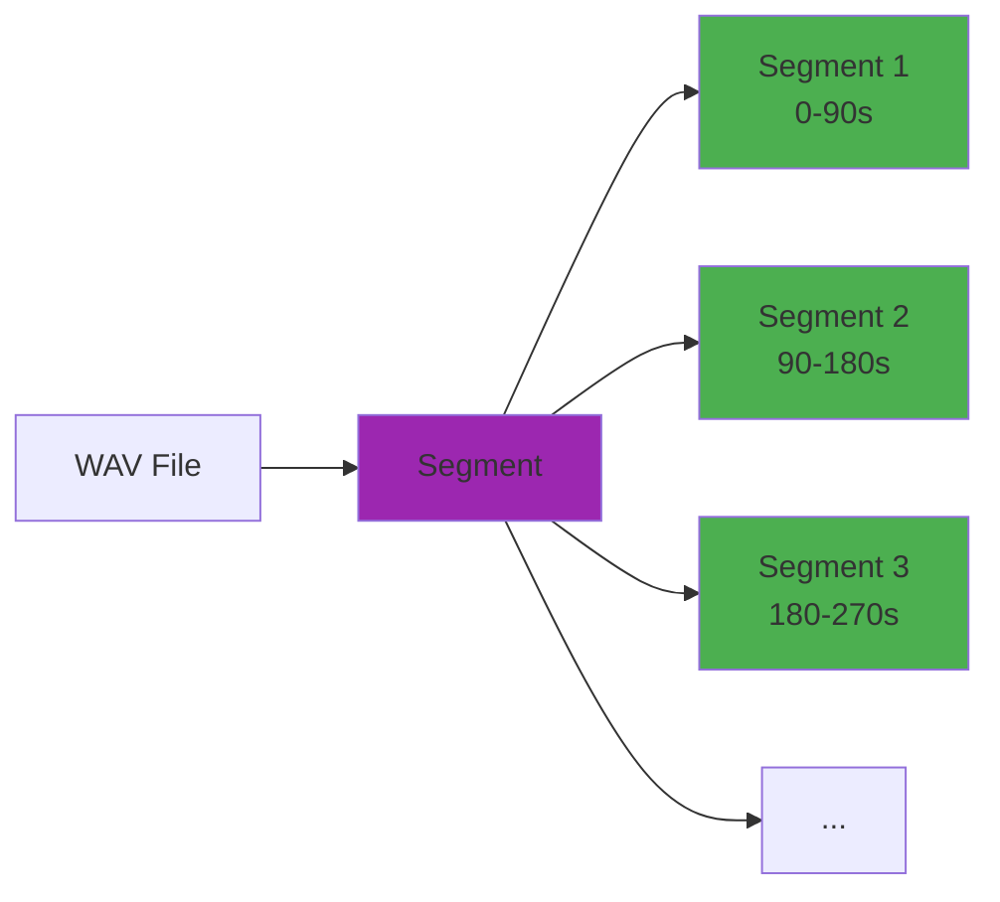

**Purpose**: Split into fixed-length chunks  
**Default**: 90-second segments  
**Overlap**: Optional overlap for better matching

### Stage 4: Fingerprinting

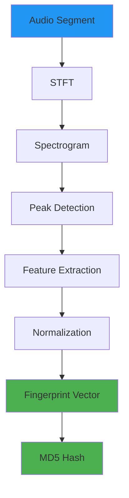

**Purpose**: Extract spectral features  
**Algorithm**: Short-Time Fourier Transform (STFT) + peak detection  
**Output**: Compact feature vector + hash

### Stage 5: Storage

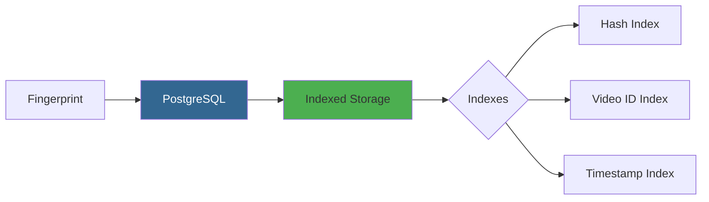

**Purpose**: Efficient storage and retrieval  
**Database**: PostgreSQL with btree indexes  
**Optimization**: Vector similarity search

---

## Matching Algorithm

### Overview

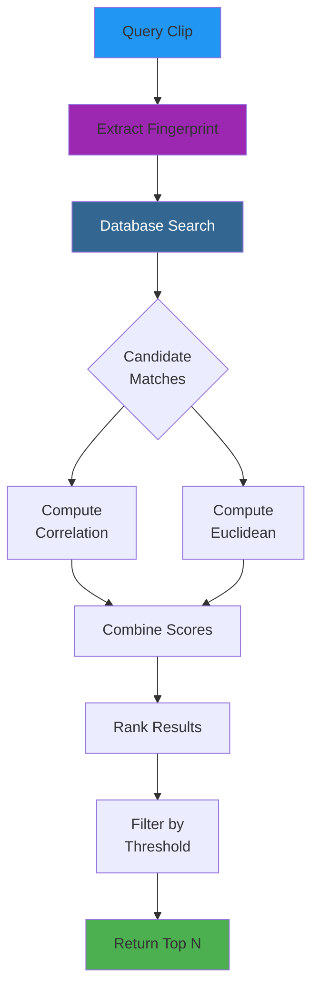

### Similarity Metrics

1. **Spectral Correlation**
   ```
   correlation = mean(|corr(query, candidate)|)
   ```

2. **Euclidean Distance**
   ```
   similarity = 1 - (distance / max_distance)
   ```

3. **Combined Score**
   ```
   confidence = (correlation + euclidean_similarity) / 2
   ```

---

## Deployment Architecture

### Single Server

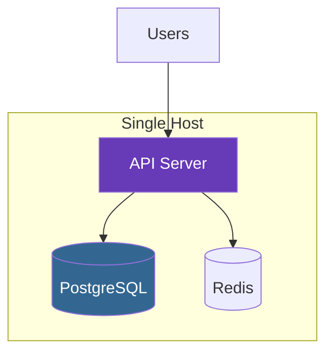

**Use case**: Development, small deployments  
**Limitations**: No redundancy, limited scaling

### Multi-Server (Recommended)

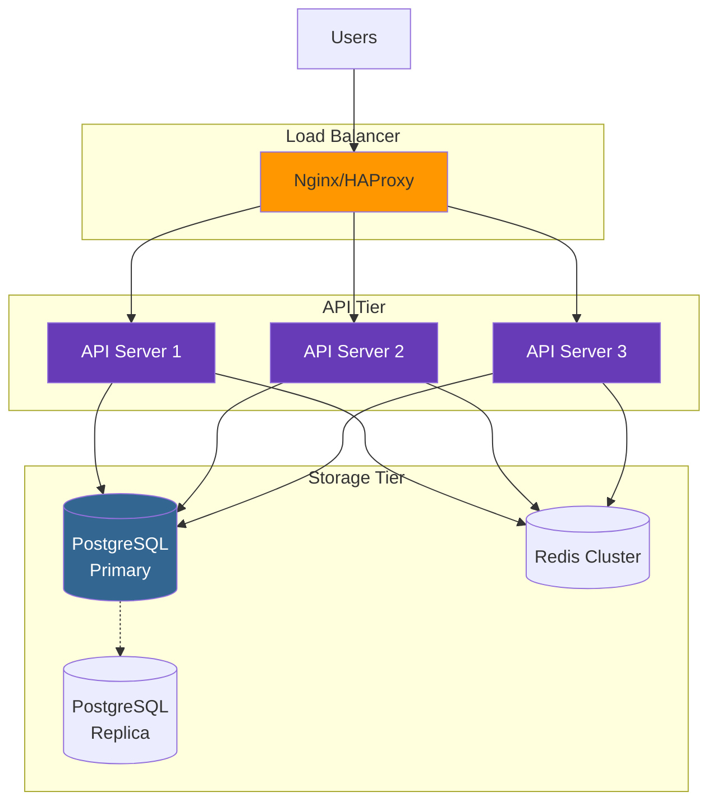

**Use case**: Production deployments  
**Features**: High availability, horizontal scaling, read replicas

---

## Key Design Decisions

### Why PostgreSQL?

- **Rich indexing**: Btree, GiST for vector search
- **ACID compliance**: Data integrity guarantees
- **Scalability**: Proven at large scale
- **Extensions**: pgvector for similarity search

### Why FastAPI?

- **Performance**: Async support, fast execution
- **DX**: Auto-generated docs, type validation
- **Modern**: Python 3.11+ type hints
- **Ecosystem**: Rich middleware and plugin support

### Why Spectral Fingerprinting?

- **Robust**: Handles compression and noise
- **Fast**: Efficient computation and comparison
- **Accurate**: High precision for matching
- **Proven**: Used in Shazam-like systems

### Why Job Queue?

- **Reliability**: Retry failed operations
- **Tracking**: Monitor progress and status
- **Scalability**: Process videos independently
- **Idempotency**: Avoid duplicate work

---

## Performance Characteristics

| Operation | Typical Time | Scaling Factor |
|-----------|-------------|----------------|
| **Video Download** | 30-120s | Video length, network |
| **Fingerprinting** | 2-10s | Audio length |
| **Single Match Query** | 50-200ms | Database size |
| **Batch Match** | 500ms-2s | Query count |

### Bottlenecks

1. **Network I/O**: YouTube downloads
2. **CPU**: FFmpeg conversion, STFT computation
3. **Database**: Large table scans without indexes
4. **Disk**: Temporary file storage

### Optimization Strategies

- **Caching**: Redis for repeated queries
- **Indexing**: Database indexes on fingerprint hashes
- **Parallelization**: Multiple download workers
- **Connection Pooling**: Reuse database connections

---

## Next Steps

<div class="grid cards" markdown>

-   :material-cube-outline:{ .lg } **Components**
    
    ---
    
    Detailed component descriptions
    
    [Learn More →](components.md)

-   :material-database:{ .lg } **Database Schema**
    
    ---
    
    Tables and relationships
    
    [Learn More →](database-schema.md)

-   :material-waveform:{ .lg } **Fingerprinting**
    
    ---
    
    Algorithm deep dive
    
    [Learn More →](fingerprinting.md)

-   :material-speedometer:{ .lg } **Performance**
    
    ---
    
    Optimization guide
    
    [Learn More →](performance.md)

</div>
