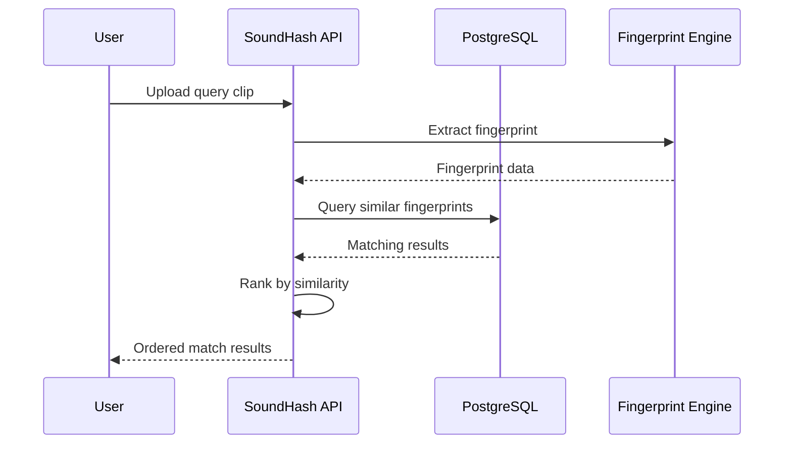

# Finding Your First Match

This tutorial walks you through the complete process of finding an audio match using SoundHash, from ingesting videos to querying for matches.

**Time required:** ~30 minutes

---

## Prerequisites

Before starting, ensure you have:

- ✅ SoundHash installed and configured
- ✅ Database initialized
- ✅ YouTube API credentials set up
- ✅ At least 10-20 videos processed

If you haven't completed these steps, see:

- [Installation Guide](installation.md)
- [Quick Start](quick-start.md)
- [Configuration](configuration.md)

---

## Overview

The matching process involves:

1. **Ingesting** a source video library
2. **Processing** videos into fingerprints
3. **Extracting** fingerprints from a query clip
4. **Comparing** query fingerprints against the database
5. **Ranking** results by similarity



---

## Step 1: Ingest a Video Library

First, let's build a library of fingerprinted videos. We'll process videos from a YouTube channel:

```bash
python scripts/ingest_channels.py \
    --channels UCo_QGM_tJZOkOCIFi2ik5kA \
    --max-videos 20 \
    --log-level INFO
```

This will:

- Fetch 20 videos from the specified channel
- Download audio from each video
- Extract spectral fingerprints
- Store fingerprints in PostgreSQL

!!! tip "Building a Good Library"
    
    For best results:
    
    - Process at least 50-100 videos initially
    - Use videos from diverse sources
    - Ensure videos have clear audio quality
    - Include videos with varied content types

### Monitor Progress

Watch the processing logs:

```
[INFO] Processing video 5/20: "Example Video Title"
[INFO] ├─ Downloading audio...
[INFO] ├─ Segmenting into 90s chunks...
[INFO] ├─ Extracting fingerprints... ████████ 12 segments
[INFO] └─ ✓ Complete (confidence: 0.94)
```

---

## Step 2: Verify Video Processing

Check that videos were processed successfully:

```python
from src.database.repositories import get_video_repository

repo = get_video_repository()

# Get all processed videos
videos = repo.get_all_videos(limit=50)

processed_count = sum(1 for v in videos if v.processed)
total_count = len(videos)

print(f"Processed: {processed_count}/{total_count} videos")

# Show some examples
for video in videos[:5]:
    status = "✓" if video.processed else "✗"
    print(f"{status} {video.title[:50]}")
```

Expected output:

```
Processed: 20/20 videos
✓ Introduction to Machine Learning
✓ Python Tutorial for Beginners
✓ Data Science Fundamentals
✓ Advanced Audio Processing
✓ Building REST APIs with FastAPI
```

---

## Step 3: Start the API Server

Launch the API server to handle match queries:

```bash
python scripts/start_api.py
```

Verify it's running:

```bash
curl http://localhost:8000/health
```

Should return:

```json
{
  "status": "healthy",
  "database": "connected"
}
```

---

## Step 4: Authenticate

Create a user and get an access token:

### Register

```bash
curl -X POST http://localhost:8000/api/v1/auth/register \
  -H "Content-Type: application/json" \
  -d '{
    "username": "testuser",
    "email": "test@example.com",
    "password": "SecurePass123!"
  }'
```

### Login

```bash
curl -X POST http://localhost:8000/api/v1/auth/login \
  -H "Content-Type: application/x-www-form-urlencoded" \
  -d "username=testuser&password=SecurePass123!"
```

Save the `access_token` from the response:

```json
{
  "access_token": "eyJhbGciOiJIUzI1NiIsInR5cCI6IkpXVCJ9...",
  "token_type": "bearer"
}
```

!!! tip "Token Management"
    
    Save your token as an environment variable:
    
    ```bash
    export SOUNDHASH_TOKEN="your_access_token_here"
    ```

---

## Step 5: Query for a Match

Now let's find matches for a video clip!

### Option A: Query by URL and Time Range

```bash
curl -X POST http://localhost:8000/api/v1/matches/find \
  -H "Authorization: Bearer $SOUNDHASH_TOKEN" \
  -H "Content-Type: application/json" \
  -d '{
    "video_url": "https://youtube.com/watch?v=dQw4w9WgXcQ",
    "start_time": 30,
    "end_time": 45
  }'
```

### Option B: Upload Audio File

```bash
curl -X POST http://localhost:8000/api/v1/matches/upload \
  -H "Authorization: Bearer $SOUNDHASH_TOKEN" \
  -F "file=@/path/to/audio_clip.mp3"
```

### Understanding the Response

```json
{
  "query_id": "abc123def456",
  "matches": [
    {
      "video_id": "xyz789",
      "title": "Rick Astley - Never Gonna Give You Up",
      "channel": "Rick Astley",
      "confidence": 0.96,
      "timestamp": 32.5,
      "duration": 15.0,
      "similarity_scores": {
        "correlation": 0.94,
        "euclidean": 0.98
      },
      "url": "https://youtube.com/watch?v=dQw4w9WgXcQ"
    },
    {
      "video_id": "abc456",
      "title": "Rick Astley - Together Forever",
      "confidence": 0.72,
      "timestamp": 145.0,
      "similarity_scores": {
        "correlation": 0.68,
        "euclidean": 0.76
      }
    }
  ],
  "processing_time": 0.342,
  "total_matches": 2
}
```

#### Key Fields

- **confidence**: Overall match confidence (0.0 - 1.0)
  - `> 0.90`: Very high confidence
  - `0.75 - 0.90`: Good match
  - `0.50 - 0.75`: Possible match
  - `< 0.50`: Low confidence

- **timestamp**: Position in the video where the match was found (seconds)
- **similarity_scores**: Individual similarity metrics
  - **correlation**: Spectral correlation coefficient
  - **euclidean**: Normalized Euclidean distance

---

## Step 6: Interpret Results

### High Confidence Match (>0.90)

```json
{
  "confidence": 0.96,
  "title": "Original Video",
  "timestamp": 32.5
}
```

✅ **This is almost certainly the source video**

- The audio is very similar
- Likely the exact clip or minimally modified
- Time offset indicates where in the video the clip appears

### Medium Confidence (0.75-0.90)

```json
{
  "confidence": 0.82,
  "title": "Similar Video"
}
```

⚠️ **Likely a match but verify**

- Could be the same clip with modifications
- Or very similar audio content
- Manual verification recommended

### Low Confidence (<0.75)

```json
{
  "confidence": 0.58,
  "title": "Possibly Related"
}
```

⚠️ **May be a false positive**

- Audio might be tangentially related
- Could be from same genre/style
- Probably not the source clip

---

## Step 7: Advanced Queries

### Filter by Confidence

```bash
curl -X POST http://localhost:8000/api/v1/matches/find \
  -H "Authorization: Bearer $SOUNDHASH_TOKEN" \
  -H "Content-Type: application/json" \
  -d '{
    "video_url": "https://youtube.com/watch?v=...",
    "start_time": 30,
    "end_time": 45,
    "min_confidence": 0.85
  }'
```

### Limit Results

```bash
curl -X POST http://localhost:8000/api/v1/matches/find \
  -H "Authorization: Bearer $SOUNDHASH_TOKEN" \
  -H "Content-Type: application/json" \
  -d '{
    "video_url": "https://youtube.com/watch?v=...",
    "max_results": 5
  }'
```

### Search Specific Channels

```bash
curl -X POST http://localhost:8000/api/v1/matches/find \
  -H "Authorization: Bearer $SOUNDHASH_TOKEN" \
  -H "Content-Type: application/json" \
  -d '{
    "video_url": "https://youtube.com/watch?v=...",
    "channel_ids": ["UCo_QGM_tJZOkOCIFi2ik5kA"]
  }'
```

---

## Step 8: Programmatic Access

### Python Example

```python
import requests

API_URL = "http://localhost:8000/api/v1"
TOKEN = "your_access_token"

headers = {
    "Authorization": f"Bearer {TOKEN}",
    "Content-Type": "application/json"
}

# Find matches
response = requests.post(
    f"{API_URL}/matches/find",
    headers=headers,
    json={
        "video_url": "https://youtube.com/watch?v=...",
        "start_time": 30,
        "end_time": 45,
        "min_confidence": 0.80
    }
)

matches = response.json()

# Process results
for match in matches["matches"]:
    print(f"Match: {match['title']}")
    print(f"Confidence: {match['confidence']:.2%}")
    print(f"Timestamp: {match['timestamp']:.1f}s")
    print(f"URL: {match['url']}")
    print("---")
```

### JavaScript Example

```javascript
const API_URL = 'http://localhost:8000/api/v1';
const TOKEN = 'your_access_token';

async function findMatches(videoUrl, startTime, endTime) {
  const response = await fetch(`${API_URL}/matches/find`, {
    method: 'POST',
    headers: {
      'Authorization': `Bearer ${TOKEN}`,
      'Content-Type': 'application/json'
    },
    body: JSON.stringify({
      video_url: videoUrl,
      start_time: startTime,
      end_time: endTime,
      min_confidence: 0.80
    })
  });
  
  return response.json();
}

// Usage
findMatches('https://youtube.com/watch?v=...', 30, 45)
  .then(matches => {
    matches.matches.forEach(match => {
      console.log(`Match: ${match.title}`);
      console.log(`Confidence: ${(match.confidence * 100).toFixed(1)}%`);
    });
  });
```

---

## Troubleshooting

### No Matches Found

!!! warning "Empty results array"

    **Possible causes:**
    
    1. **Insufficient database**: Process more videos
    2. **Time range too short**: Use 10-15+ seconds
    3. **Audio quality issues**: Ensure clear audio
    4. **Modified audio**: Heavy compression or effects can reduce matches
    
    **Solutions:**
    
    ```bash
    # Process more videos
    python scripts/ingest_channels.py --max-videos 50
    
    # Use longer clips (15-30 seconds recommended)
    # Check audio quality of query clip
    ```

### Low Confidence Scores

!!! warning "All matches below 0.70"

    **Possible causes:**
    
    1. **Different audio source**: Query isn't in database
    2. **Heavy modification**: Audio heavily processed/compressed
    3. **Background noise**: Poor query audio quality
    
    **Solutions:**
    
    - Verify the clip exists in your database
    - Try a cleaner section of audio
    - Adjust similarity thresholds in configuration

### API Authentication Errors

!!! failure "401 Unauthorized"

    **Solution:** Get a fresh token
    
    ```bash
    # Login again
    curl -X POST http://localhost:8000/api/v1/auth/login \
      -H "Content-Type: application/x-www-form-urlencoded" \
      -d "username=testuser&password=SecurePass123!"
    ```

---

## What's Next?

Congratulations! You've successfully found your first audio match. 🎉

### Continue Learning

<div class="grid cards" markdown>

-   :material-cog:{ .lg } **Configuration**
    
    ---
    
    Fine-tune matching parameters
    
    [Configuration →](configuration.md)

-   :material-chart-line:{ .lg } **Architecture**
    
    ---
    
    Understand how matching works
    
    [Architecture →](../architecture/fingerprinting.md)

-   :material-robot:{ .lg } **Social Bots**
    
    ---
    
    Automate matching with bots
    
    [Bot Guide →](../guides/bots.md)

-   :material-api:{ .lg } **API Reference**
    
    ---
    
    Explore all API endpoints
    
    [API Docs →](../api/index.md)

</div>

---

## Additional Resources

- [Similarity Tuning Guide](../architecture/performance.md)
- [API Reference](../api/matches.md)
- [Troubleshooting](../reference/troubleshooting.md)
- [FAQ](../reference/faq.md)
