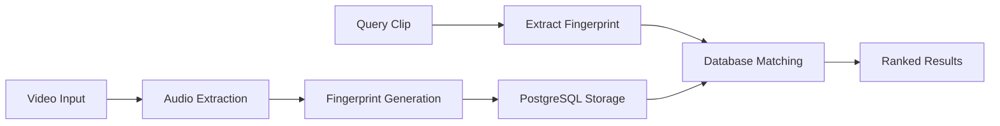

# Welcome to SoundHash

<div align="center">

[](https://github.com/subculture-collective/soundhash/actions/workflows/ci.yml)
[](https://codecov.io/gh/subculture-collective/soundhash)
[](https://www.python.org/downloads/)
[](https://github.com/subculture-collective/soundhash/blob/main/LICENSE)

**A sophisticated system for matching audio clips from videos across social media platforms using audio fingerprinting and PostgreSQL.**

[Get Started](getting-started/installation.md){ .md-button .md-button--primary }
[View on GitHub](https://github.com/subculture-collective/soundhash){ .md-button }

</div>

---

## 🎯 What is SoundHash?

SoundHash is an advanced audio fingerprinting system designed to identify and match video clips across social media platforms. Using spectral analysis and PostgreSQL's powerful querying capabilities, it can quickly find matching audio segments even in noisy or modified clips.

## ✨ Key Features

<div class="grid cards" markdown>

-   :material-music-note:{ .lg .middle } __Audio Fingerprinting__

    ---

    State-of-the-art spectral analysis using STFT (Short-Time Fourier Transform) for robust audio identification

-   :material-database:{ .lg .middle } __PostgreSQL Storage__

    ---

    Scalable storage with efficient indexing and querying for millions of audio fingerprints

-   :material-robot:{ .lg .middle } __Social Media Bots__

    ---

    Automated integration with Twitter and Reddit for real-time clip matching

-   :material-youtube:{ .lg .middle } __YouTube Integration__

    ---

    Seamless channel ingestion with OAuth support and metadata extraction

-   :material-api:{ .lg .middle } __REST API__

    ---

    Comprehensive API with JWT authentication, rate limiting, and interactive documentation

-   :material-speedometer:{ .lg .middle } __High Performance__

    ---

    Optimized matching algorithms with caching and parallel processing

</div>

## 🚀 Quick Start

Get up and running in just a few minutes:

```bash
# Clone the repository
git clone https://github.com/subculture-collective/soundhash.git
cd soundhash

# Set up environment
cp .env.example .env
# Edit .env with your configuration

# Install dependencies
pip install -r requirements.txt

# Initialize database
python scripts/setup_database.py

# Start the API server
python scripts/start_api.py
```

→ [Detailed Installation Guide](getting-started/installation.md)

## 📊 How It Works



1. **Ingestion**: Videos are downloaded and audio is extracted
2. **Processing**: Audio is segmented and fingerprinted using spectral analysis
3. **Storage**: Fingerprints are stored in PostgreSQL with efficient indexing
4. **Matching**: Query clips are compared against stored fingerprints
5. **Results**: Matching videos are returned with confidence scores

→ [Architecture Overview](architecture/overview.md)

## 🎯 Use Cases

- **Content Creators**: Track where your content is shared across platforms
- **Rights Management**: Identify unauthorized use of copyrighted material
- **Research**: Analyze video propagation and viral content spread
- **Social Monitoring**: Track audio clips across social media networks
- **Archive Management**: Organize and deduplicate video collections

## 📚 Documentation Sections

<div class="grid" markdown>

[**Getting Started**](getting-started/index.md)
:   Installation, configuration, and your first match

[**Guides**](guides/index.md)
:   Step-by-step tutorials for common tasks

[**API Reference**](api/index.md)
:   Complete API documentation with examples

[**Deployment**](deployment/index.md)
:   Production deployment guides for Docker, Kubernetes, and cloud platforms

[**Architecture**](architecture/index.md)
:   Deep dive into system design and components

[**Development**](development/index.md)
:   Contributing, testing, and development setup

[**Reference**](reference/index.md)
:   Configuration options, CLI commands, and troubleshooting

</div>

## 🤝 Community & Support

- **GitHub Issues**: [Report bugs or request features](https://github.com/subculture-collective/soundhash/issues)
- **Discussions**: [Ask questions and share ideas](https://github.com/subculture-collective/soundhash/discussions)
- **Contributing**: [Read our contributing guide](development/contributing.md)

## 📈 Project Status

SoundHash is actively maintained and under development. Check out our:

- [Roadmap](https://github.com/subculture-collective/soundhash/issues/34)
- [Project Board](https://github.com/users/onnwee/projects)
- [Milestones](https://github.com/subculture-collective/soundhash/milestones)

## 📄 License

SoundHash is released under the [GNU General Public License v3.0](https://github.com/subculture-collective/soundhash/blob/main/LICENSE).

---

<div align="center" markdown>

**Ready to get started?**

[Installation Guide](getting-started/installation.md){ .md-button .md-button--primary }
[Quick Start Tutorial](getting-started/quick-start.md){ .md-button }

</div>
